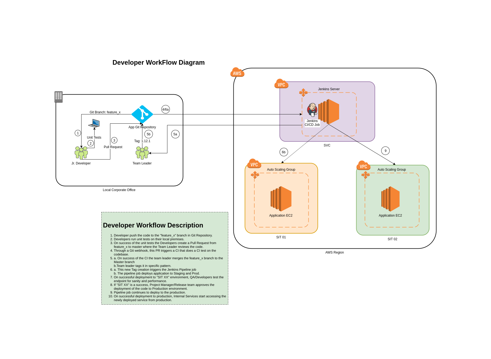

/*
 * File: DEVELOPERS.md
 * Project: smartech-infra
 * Created Date: Saturday September 14th 2019
 * Author: Ashay Varun Chitnis
 * -----
 * Last Modified: Saturday September 14th 2019 3:45:30 pm
 * Modified By: Ashay Varun Chitnis at <ashay.chitnis@gmail.com>
 * -----
 * Copyright (c) 2019 Ashay Chitnis, all rights reserved.
 */

# Developer Perspective

## Developer Workflow

## WorkFlow Components

### Local Corporate Office

#### Thane Office

 1. Jr. Developers
 2. Team leaders
 3. Local Network

#### Lower Parel Office
 1. Git Repository
 2. Partial Mmail Architecture
 3. Lower Parel Network
 4. GitBucket Server
 5. Partial Mmail architecture

### AWS Cloud

#### Service VPC

 1. SSH Server
 2. Openvpn Server
 3. NAT Server
 4. Jenkins Server
 5. Workers (Jenkins slaves)

#### sitN VPC
 
 The AWS SIT envionment where particular feature is being deployed.

## Common Terms

  1. **Devops**: Developer Operations
 
  2. **CI/CD**: Continuous Integration and Continuous Delivery.
 
  3. **AWS**: It means one of the following one of the components in [AWS Cloud](#aws-cloud).
 
  4. **svc**: [Service environment](#service-vpc) or component(s) in it.
 
  5. **sit**: One of the [SIT environment](#sitn-vpc)
 
  6. **Jenkins**: Jenkins Server or its worker
 
  7. **Jump box**: SSH Jumpbox server
 
  8. **VPN Server**: Openvpn Server
 
  9. **Endpoint(s)**: SIT Environment endpoint(s) to one of the Services inside SIT Environment.
  
  10. **Infra repo**: [Smartech infrastructure repository](https://corporate.netcore.co.in/gitbucket/Iac/smartech) that possesses the SIT infra code !!! Warning !!! Be wary of the repo name.
  
  11. **Playbook**: [Smartech infrastructure ansible playbook repository](https://corporate.netcore.co.in/gitbucket/Iac/smartech-infra-playbook) that helps install the code on an EC2.
  
  12. **Application**: Your service application that's been developed!
  
  13. **Webhook**: Jenkins URL provided by Devops team to be added into the Settings Section of your application git repository.
  
  14. **Tag**: gitBucket application repository tag. You'll see it under `Releases` section of GitBucket once you create a tag on your application repository.
  
  15. **Lang Type**: Application lang type. Whether your application language is a `compiled` type application (e.g. C, Java, Go) or is it `scripted` type application (e.g. Perl, Python, PHP).
  
  16. **Devops Bucket**: `smartech-devops` AWS S3 bucket that holds all the central devops stuff/encryption files/app config files. EC2 instances are able to download stuff from here.
  
  17. **Deploy Bucket**: `smartech-deploy` AWS S3 bucket. Your application artifact (scripted/compiled) is placed here. Your application's git commit id is used as the reference.
  
  18. **Pipeline**: A Jenkins Pipeline Job that guides your code to `sit` deployment environment. Your application git commit ID is a *major* reference for pipeline to work.
  
  19. **Provisioning Job**: A Jenkins job that pulls the code from `Deploy Bucket` and installs on an EC2 instance. It also runs the configuration that is required for your application to run.  You'll see the git commit Id SHA in the ec2 instance environment variable.
  
  20. **Docker Build**: The build is accomplished by one of the sit environment workers in a docker container. The artifact is pushed to S3 `Deploy Bucket`.
  
  21. **App Type**: Whether your application is core application or peripheral application to the *feature* you are developing.
  
  22. **Common Tag**: A tag that *same-feature-developing-team-leads* will choose in order to refer the deployable git SHA from for the application repository.
  
  23. **Wrapper Dir**: A `wrapper_dir` is a parent folder where the developer will place the folder with application specific configuration files that will be used by the application.
  
  24. **Force Build**: For a given git commit ID, an application artifact once placed in the S3 `Deploy Bucket`, will not be built again by the CI/CD system. This behaviour can be overridden by asking devops engineer to enable `force_build`.
  
  25. **dockerfile**: *Only for `lang_type` as `compiled`*. The SDK Dockerfile used by Docker server in order to build the application. *Set by devops engineer.*
  
  26. **Artifact Dir**: *Only for `lang_type` as `compiled`*. The directory in which the CI/CD system should find the built artifact after the build is done. e.g. `target` dir for some `ceaf` applications. *Set by devops engineer.*
  
  27. **build_dir**: *Only for `lang_type` as `compiled`*. Docker build [PATH](https://docs.docker.com/engine/reference/commandline/build/). *Set by devops engineer.*
  
  28. **build_args**: *Only for `lang_type` as `compiled`*. Docker build [OPTIONS](https://docs.docker.com/engine/reference/commandline/build/). *Set by devops engineer.*
  
## WorkFlow Description

### Pre-development

#### Team Leads (TL)

 1. Devops and application TLs decide to create a separate SIT environment for `feature_x`.

 2. Application TLs decide which services are `core` services and which ones are `peripherial` and communicate it to the Devops TLs.

 3. Application TLs choose a git Branch name for `feature_x` which they create. They also communicate this to the Devops TLs.

 4. Application and Devops TLs settle for a common git Tag (e.g. `sit0-featureName-1.12.0`) so that CI/CD system is able to distinguish this `feature_x` from other features. This tag will be looked into only in the git branch above that is mentioned to the devops team. This Tag is communicated to the Devops TLs.

 5. Application TLs tell the Devops TLs the build sequence for different applications they wish to have in case the sequence is different.
 
 ### Development

 #### Devops Engineers

 1. With the information provided by the Devops Team Lead, the devops engineers create the required SIT AWS environment with the required devops/encryption and configuration files and folders in the `Devops Bucket`.

 2. The devops engineers run the Jenkins seed job in order to populate the required sit environment specific Jenkins jobs.

 3. The devops engineers communicate the Jenkins URL to be used as the Webhook URL to the Developers.

 4. The devops engineers communicate a sample SDK [Dockerfile](https://docs.docker.com/engine/reference/builder/) to the application developers.

 5. Devops Engineer creates the DNS `endpoints` for the SIT environment with the help of the infrastructure team.

 #### Application Developers

 1. Developers pull the git branch mentioned by application TL for `feature_x` from the application git repository.
 
 2. Developers prepare an SDK Dockerfile using required language SDK docker image for their application.

 3. Developers keep all the [ARG](https://docs.docker.com/engine/reference/commandline/build/#set-build-time-variables---build-arg) mentioned in the sample Dockerfile.

 4. Developers make several commits to build the artifact and unit test their features locally.

 5. Developers edit the configuration files and adds them to a new config folder inside `wrapper_dir`

 6. Once ready they inform the application TL to do a code review.

 7. Application TL does the code review and decides whether to implement the feature into the SIT environment.

 8. In order to implement the feature to SIT environment the TL tags the appropriate commit Id to with the `common_tag`. In case of `peripheral` application types it will be usually the one pointed by the git branch `HEAD`. In case of `core` it will be specific commit id which can optionally be different than the one pointed by `HEAD`.

 9. The tag creation causes the webhook to be triggered and that triggers the Jenkins application pipeline.

 10. On the successful completion of Jenkins pipeline job the results can be viewed at the application `endpoint` pointed by the devops engineers.

### Testing 

#### Test Team

 1. The test team uses the public `endpoints` commuicated by the devops/application TLs to do integration testing on the feature.